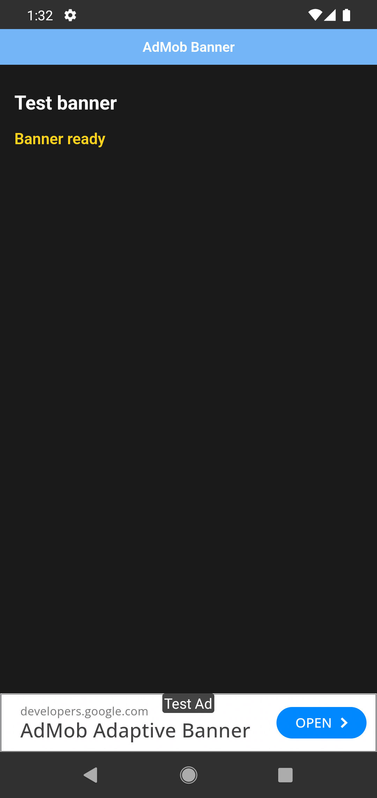
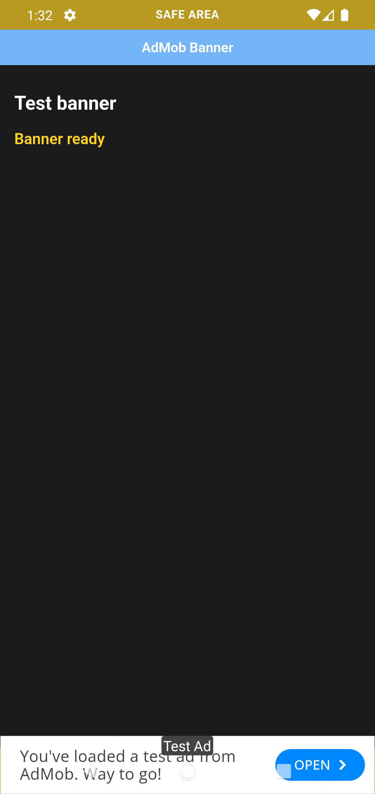

# AdMob Safe Area Reproduction App

This project is a small Capacitor 8 example used to reproduce banner safe-area behavior on Android across different Android System WebView versions.

## Background

After updating to Capacitor 8.5.2, Android safe-area handling changed. The reported behavior is different depending on the Android version and the WebView version installed on the device:

- Before the beta, Android 14 and below with WebView versions lower than 140 could apply the banner safe area twice, causing double padding.
- The beta appears to fix the duplicated padding on older WebView versions.
- With the beta, Android 14 and below with WebView versions 140 or higher can fail to apply the safe area, causing the banner to appear behind the navigation bar.
- Android 15 and 16 currently handle the banner correctly in the tested configurations. Android 17 should be tested when available.

The plugin beta added the `enableCapacitor8SafeAreaHandling` option, but both WebView branches must be tested independently. Testing only one WebView version on an Android emulator is not enough because Android System WebView is updated separately from the Android OS.

Related references:

- [Capacitor safe-area refactor](https://github.com/ionic-team/capacitor/pull/8535)
- [Capacitor Android system bars documentation](https://github.com/ionic-team/capacitor/blob/main/core/system-bars.md#android-note)

## Observed Regressions

Both screenshots below were captured with the beta version of the plugin on Android 12.

### Android 12 + WebView 91 (Beta Working)

With WebView `91.0.4472.114`, the beta fixes the duplicated safe-area padding that occurred before the beta:



### Android 12 + WebView 153 (Beta Regression)

With WebView `153.0.8010.36`, the beta can render the banner behind the navigation bar:



## Reproduction App

The example displays a test adaptive banner using:

```text
ca-app-pub-3940256099942544/9214589741
```

The banner is created with Capacitor 8 safe-area handling enabled:

```js
await AdMobNextGen.createBanner({
	adUnitId: BANNER_AD_UNIT_ID,
	adSize: 'ADAPTIVE',
	position: 'BOTTOM',
	isAutoShow: true,
	enableCapacitor8SafeAreaHandling: true,
});
```

The native Android activity also follows the Capacitor recommendation:

```java
EdgeToEdge.enable(this);
```

## Requirements

- Node.js 20 or newer
- pnpm
- Android Studio with an Android emulator
- Google Play Store enabled in the emulator so Android System WebView can be updated

Install dependencies with:

```bash
pnpm install
```

## Run the Example

Build, sync Capacitor, and launch Android:

```bash
pnpm start
```

The Android command may ask you to select an emulator. The app includes a `Show banner` button so banner loading can be tested independently after AdMob initialization completes.

## WebView Test Matrix

Do not validate the plugin with only one Android version or one WebView version. The recommended approach is to test several Android versions and, for each relevant Android version, compare a WebView below 140 with a WebView version 140 or higher.

| Android version | WebView version | Required test |
| --- | --- | --- |
| Android 11, 12, or 13 | Below 140 | Confirm the beta does not reintroduce duplicated padding |
| Android 11, 12, or 13 | 140 or higher | Check that the banner stays above the navigation bar |
| Android 15 or 16 | Below 140 and 140 or higher | Confirm both WebView paths remain compatible |

This cross-version coverage is important because the Android OS version and Android System WebView version are independent variables. A result from Android 12 with WebView 91 does not represent Android 12 with WebView 153, and neither result replaces tests on Android 11, 13, 15, or 16.

The Android 12 emulator supplied by Android Studio currently provides a useful baseline:

```text
WebView: 91.0.4472.114
```

After updating Android System WebView from the Play Store, the same emulator can be tested again with:

```text
WebView: 153.0.8010.36
```

## Check the Installed WebView Version

With the emulator running and connected through ADB:

```bash
adb devices
adb -s emulator-5554 shell getprop ro.build.version.release
adb -s emulator-5554 shell dumpsys package com.google.android.webview | grep versionName
```

Record both the Android release and the WebView `versionName` for every test. Do not report an Android result without also recording the WebView version.

## Reset WebView Updates

To remove the updates from Android System WebView and return the emulator to the WebView version included in its system image, run:

```bash
adb -s emulator-5554 shell pm uninstall com.google.android.webview
```

This removes the installed updates; it does not remove the system WebView package permanently. After running the command, verify the restored version with the ADB command above. You can then update WebView again from the Play Store to test the newer WebView branch.

## Test Procedure

1. Select an Android version from the test matrix and record its WebView version.
2. Build and launch the app.
3. Wait until the app reports that the AdMob SDK is ready.
4. Tap `Show banner`.
5. Check the banner against the bottom navigation bar and record the result.
6. Update Android System WebView from the Play Store or use an emulator with the other WebView branch.
7. Reboot the emulator if Android requests it.
8. Record the new WebView version with ADB.
9. Repeat the same banner test without changing the Android OS version.
10. Repeat the process on the other Android versions in the matrix.
